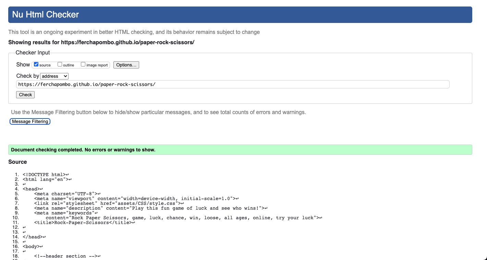
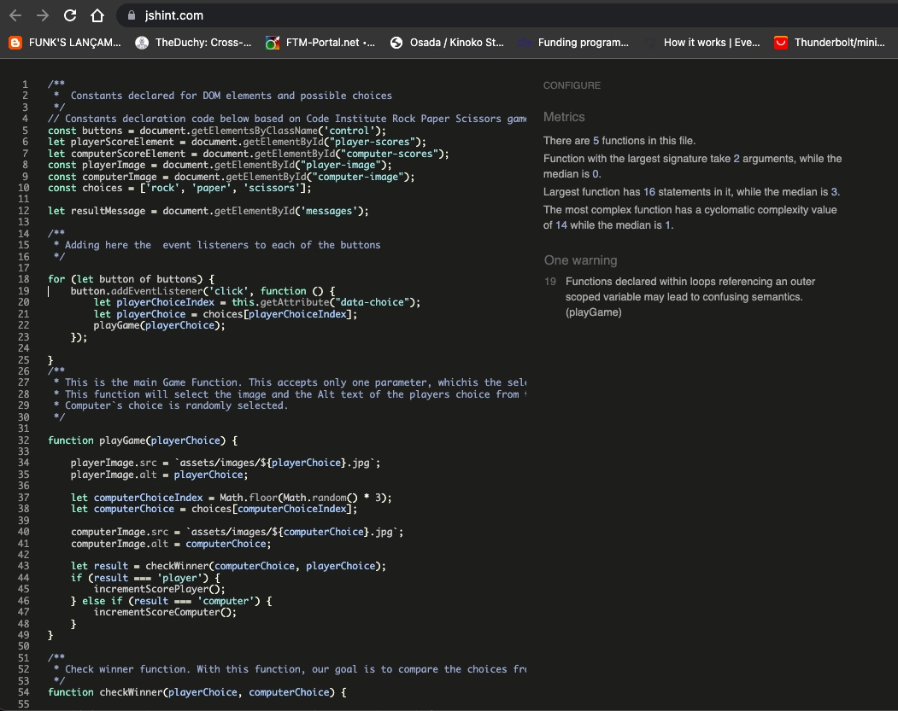
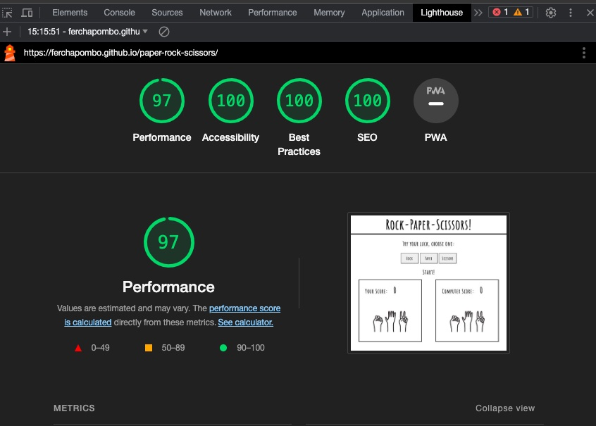

# Rock, Paper, Scissors Game

Rock, Paper Scissors is an online game to try your luck! Choose one of the 3 options and play against the computer. This very famous and popular game is brought to the computer for a more fair and exact result with no cheating possible. Have fun with friends and family, or be adventurous and make life-changing decisions.

Users of this game will be able to make decisions based on intuition and then have their luck proved by the computer`s random choice. try it out!

The live website on Github pages can be accessed at the following link:

[Paper, Rock, Scissors](https://ferchapombo.github.io/paper-rock-scissors/)

## Existing Features

### The Header

The header contains the title of the webpage and says exactly what the game is about. Rock, Paper, Scissors is written in a simple, clear, and fun typography. The title is centered in the middle of the webpage as the only element on it.

### Game Options

This section has the 3 options to choose from. The instructions are clear on what to do and how to play. 3 buttons are displaying the 3 options from which to choose. These, are interactive and can be clicked with the player's choice, for the computer to generate a random choice too.

### Game Results

In this feature of the webpage, when opening or refreshing the page, the main image of the game appears. A group of 3 hand-drawn hands, in a very simple style, make the gestures of the 3 options of the game.

When one of the buttons, is clicked by the player, first, the image of their selection updates to the hand that represents their choice.

Automatically, a Javascript code runs to generate a random choice by the computer and selects the other image accordingly.

The winner is announced in the middle of the page, right under the buttons. the text is updated to 'You Won',' Computer Won!, Try again!', or 'It's a Draw!'.

### Footer Area

The footer of the webpage is positioned at the bottom of the webpage. In it, you can find the rules, again, with the same legible typography.

You can also find the two links that click to my webpage and my GitHub profile. Both links are clickable and open on a new webpage.

### Features to Implement

In the future, I would like to implement an audio track for the webpage and a chosen amount of times a player needs to win for the game to start all over.

## Testing

* This game was tested on Android and iPhone mobile devices, as well as tested in Chrome and Firefox.
* I confirm that, by playing with it, the scores are always correctly counted and added to the scores of each, player and the computer.
* I tested the adaptability of the header, game area, and footer are always responsive.
* I  tested the fonts, colors, and features are easy to read and access thanks to the Lighthouse tool in DevTools.
  
### Online testing sources used:
* *HTML*
Before final deployment, no errors were returned when passing through the offical W3C Validator
* *CSS*
Before final deployment, no errors were found when passing through the official W3C Jigsaw CSS Validator
* *Javascript*
The javascript code was run through jshint to check for any errors.

## Bugs

Throughout this module I encountered many difficulties with the learning material, the time I invested in it, and extensive Google searching. instead of stating one by one the bugs y fixed, I will be very descriptive with the sources I used. I hope I did not miss too many links.

## Deployment

- This site was deployed using Github pages, the steps i followed are the following:
1. Inside my github repository, i navigated to Settings tab.
2. I went to the pages section, and changed the branch name from "none" to main" and saved the changes.
3. Then github created my url repository succesfully,  and provided me the link to it.
   
   
## Credits

* Creator: Fercha pombo @ferchapombo
* Link to Github : [Github](https://github.com/FerchaPombo)
  
Throughout the process of creating this game application, I went through different websites and forums that helped me with the CSS styling of my game,  as well as with creating the functions of my Javascript.
Special thanks to the community in Slack and to Vitor Barbosa_5P who helped me through the process of checking and updating my score.

### List of links used as learning and source material 

[Image Positioning](https://stackoverflow.com/questions/61036257/i-have-a-div-with-images-and-buttons-inside-the-buttons-center-but-the-images)

[Position image in bottom](https://stackoverflow.com/questions/17934332/how-do-i-position-an-image-at-the-bottom-of-div)

[Spans and Divs](https://stackoverflow.com/questions/2690237/how-to-position-a-span-inside-a-headline-tag)

[Code](https://www.codecademy.com/forum_questions/53715ac6282ae3f78c000bd0)

[JavaScript](https://www.codebrainer.com/blog/tic-tac-toe-javascript-game)

[Javascript functions](https://www.codecademy.com/forum_questions/53715ac6282ae3f78c000bd0)

[Source code for function update score](https://stackoverflow.com/questions/71484752/how-to-store-and-update-score-in-the-game)

[Source code for function update score](https://you.com/search?q=how+to+add+a+score+counter+to+a+game+in+javascript&tbm=youchat&cfr=chatb&cid=c2_00665cce-1db7-4665-bd5a-407ae58f8174)

[Source code for function update score](https://www.w3schools.com/graphics/game_score.asp)

[Paddings and Margins](https://theme.co/forum/t/footer-content-overlapping-with-main-content/73859/2)

[ImportStatement](https://stackoverflow.com/questions/10036977/best-way-to-include-css-why-use-import#10037064)

[&& usage in Javascript](https://developer.mozilla.org/en-US/docs/Web/JavaScript/Reference/Operators/Logical_AND)

[Pushing and Pulling on Github](https://stackoverflow.com/questions/10298291/cannot-push-to-github-keeps-saying-need-merge)

[Pushing and Pulling on Github](https://github.com/desktop/desktop/issues/14431)

[Pushing and Pulling on Github](https://www.w3docs.com/learn-git/git-pull.html)

[Inner text](https://www.w3schools.com/jsref/prop_node_innertext.asp)

[Help with footer positioning](https://stackoverflow.com/questions/33278664/absolute-positioning-with-footer-not-working)

[Help with understanding inner text](https://www.w3schools.com/jsref/prop_node_innertext.asp)

[Help with tracking score](https://developer.mozilla.org/en-US/docs/Games/Tutorials/2D_Breakout_game_pure_JavaScript/Track_the_score_and_win)

[Help with tracking score](https://developer.mozilla.org/en-US/docs/Games/Tutorials/2D_Breakout_game_pure_JavaScript/Track_the_score_and_win)

[Help with tracking score](https://www.geeksforgeeks.org/rock-paper-and-scissor-game-using-javascript/)

[Help with tracking score](https://stackoverflow.com/questions/71484752/how-to-store-and-update-score-in-the-game)

[Help with tracking score](https://you.com/search?q=how+to+add+a+score+counter+to+a+game+in+javascript&tbm=youchat&cfr=chatb&cid=c2_5e50f44d-4d53-4a30-bc04-db8cc258c925)

[hHlp with tracking score](https://www.w3schools.com/graphics/game_score.asp)

[Help with tracking score](https://stackoverflow.com/questions/17976883/rock-paper-scissors-in-javascript)

[help with tracking score](https://plainenglish.io/blog/building-a-rock-paper-scissors-game-with-javascript-bce23d39509d)

[inner text vs inner html](https://stackoverflow.com/questions/19030742/difference-between-innertext-innerhtml-and-value)

[Help with event reference](https://developer.mozilla.org/en-US/docs/Web/Events) 

[Help with css borders and margin](https://stackoverflow.com/questions/5664877/creating-space-between-an-element-and-its-border)

[Help with css borders and margin](https://www.freecodecamp.org/news/css-margins/)

[Markdown Language](https://docs.moodle.org/402/en/Markdown#Images)
